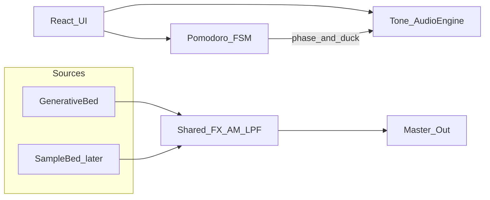

# RFC: Momentone technical design

| Field | Value |
|-------|--------|
| **Status** | Draft |
| **Date** | 2026-08-01 |
| **Product** | Momentone |
| **Related** | [PRD: Momentone](./prd.md) |

## 1. Summary

Build Momentone as a **static Vite + React + TypeScript** web app. Audio is a **Tone.js** graph: generative focus sources through a shared FX bus (warmth filter + amplitude modulation), with Pomodoro-driven **break ducking**. No backend for v1. Optional curated beds later attach as samples into the same bus and can ship as static files.

## 2. Motivation

See the [PRD](./prd.md) for product goals. Technically we need:

- Reliable browser audio under autoplay policies
- A clear separation between **session timing** and **sound generation**
- An extension point for curated beds without rewriting the engine
- Free-tier deploy suitable for a workshop demo link

## 3. Goals / non-goals (technical)

**Goals**

- Client-only architecture; zero required server APIs for v1
- Testable Pomodoro state machine independent of React and Tone
- Shared FX path for generative and future sample sources
- Sensible handling of AudioContext suspend / background tabs

**Non-goals**

- Next.js, SSR, or a database
- Streaming CDN auth, user uploads, or multi-tenant audio storage
- Bit-exact reproduction of any commercial focus-music pipeline
- Paid music generation APIs in v1

## 4. Proposal

### 4.1 High-level architecture



Suggested source layout:

```text
src/
  audio/          # Tone graph: engine, sources, fx — no React
  session/        # Pomodoro FSM + pure helpers
  ui/             # React pages/components binding controls
  app/            # shell, routing if any (single view is fine)
```

### 4.2 Audio engine

**Signal chain (v1)**

1. **Sources (generative)**
   - Soft harmonic pad / drone (stable key, slow evolution)
   - Gentle rhythmic / pulse layer (subtle, not song-like)
   - Filtered noise (pink/brown) for masking
2. **Shared FX bus**
   - Low-pass / warmth to reduce distracting highs
   - Amplitude modulator: user **depth** 0–100%; rate in a focus-oriented band (~12–20 Hz), tunable in code/presets
3. **Master gain** + Pomodoro ducking
   - Work: nominal level
   - Break: same graph, lower master/bus gain (PRD: continuity, quieter)

**Libraries:** Tone.js over Web Audio.

**Controls wired from UI:** start/stop (or play/pause), master volume, modulation depth, texture preset (maps to generative + FX params only).

**Start policy:** AudioContext / Tone starts only after an explicit user gesture (`Start`).

### 4.3 Extension: curated beds (v1.5+)

- Add `SampleBed` (Tone `Player` / grain player) feeding the **same** FX bus.
- Host a few seamless loops under `public/beds/*` on the static host.
- **No backend required** for a small fixed library. Introduce object storage or an API only if uploads, large catalogs, or gated assets appear later.

### 4.4 Pomodoro session module

Pure TypeScript state machine, no Tone imports:

| State | Behavior |
|-------|----------|
| `idle` | Prefs editable; audio stopped or silent |
| `work` | Countdown; audio at work level |
| `break` | Countdown; audio ducked |
| `paused` | Timer frozen; audio paused or held per UX choice (prefer pause both) |

Events: `start`, `pause`, `resume`, `skipPhase`, `tick` / deadline reached, `reset`.

Defaults: work **25m**, break **5m** (from prefs). Persist prefs via `localStorage` in the UI layer.

**Timer accuracy:** Prefer wall-clock deadlines (`Date.now()` + duration) over `setInterval` alone so background-tab throttling drifts less. Reconcile on `visibilitychange`. Document remaining Safari/Chrome quirks as known limitations for the demo.

### 4.5 UI

Single composition, session-first:

- Idle: brand **Momentone**, short line of purpose, duration prefs, Start
- Active: large timer, phase label (Work / Break), play/pause, skip, volume, modulation, optional texture

Keep chrome minimal during focus (few competing controls; deep-work friendly).

### 4.6 Deploy

- Build: Vite production build
- Host: Cloudflare Pages **or** Vercel free tier
- Env: none required for v1
- HTTPS required for reliable AudioContext on modern browsers

## 5. Alternatives considered

| Option | Why not for v1 |
|--------|----------------|
| **Library-first tracks + light FX** | Faster “music app” feel, but needs assets/licensing early; less aligned with generative-first + free tier |
| **Generative-only with no sample seam** | Slightly less code, but making beds later forces a redesign |
| **Next.js + backend** | Unnecessary for demo; adds cost/complexity |
| **Binaural-beats-centric design** | Mixed evidence; not the PRD’s research bet |
| **Paid AI beds in v1 (e.g. Suno)** | Conflicts with free-tier preference; defer |

**Chosen path:** Generative-first engine with a sample-ready FX bus (Approach 1 v1 ≈ Approach 3 surface area).

## 6. Risks & mitigations

| Risk | Mitigation |
|------|------------|
| Generative audio sounds thin or fatiguing | Iterate presets; keep Soft/Standard/Strong; listen checklist before demo |
| Over-claiming science / patent sensitivity | PRD copy rules; implement general AM + filtering; no Brain.fm assets or proprietary replication claims |
| Autoplay / suspended AudioContext | Explicit Start; resume prompt on return |
| Timer drift in background tabs | Wall-clock deadlines + visibility reconcile |
| Workshop demo flakiness on unknown browsers | Smoke-test Chrome + Safari; show unsupported message if needed |

## 7. Testing plan

**Automated (lightweight)**

- Unit tests for Pomodoro FSM: transitions, skip, pause/resume, duration boundaries

**Manual listen checklist**

- [ ] Start requires gesture; sound begins
- [ ] Modulation depth low vs high is audible
- [ ] Work → break ducks volume; texture continuous
- [ ] Break → work restores level
- [ ] Pause/resume keeps phase and audio coherent
- [ ] Prefs survive reload
- [ ] Deployed URL works for a second device/user

## 8. Rollout (workshop)

1. Implement v1 locally (separate session)
2. Deploy static site to free host
3. Share URL; no accounts
4. Optional: 1–2 curated beds post-demo if time allows (static assets only)

## 9. Open technical decisions (decide in implementation)

- Exact Tone node graph and modulator waveshape
- Break duck amount (e.g. −8 to −12 dB) and fade time
- Whether pause silences audio or only freezes the timer (recommend both)
- Cloudflare Pages vs Vercel

## 10. References (informative)

- Woods, K.J.P., et al. (2024). Rapid modulation in music supports attention in listeners with attentional difficulties. *Communications Biology*.
- Brain.fm public science materials (modulation / phase-locking positioning) — inspiration only, not a spec to copy.
- Tone.js documentation — Web Audio abstraction for the engine.
